# Chironia Project: The Digital Artisan's Manifesto

This repository is a showcase of the AI backend for the Chironia project, a platform dedicated to special needs education. It's more than just code; it's a reflection of a development philosophy I call the **"Digital Artisan's Manifesto."**

### Our Manifesto
*   **Beyond Functionality, We Seek Craftsmanship:** We don't just build features; we craft intelligent systems. Every component, from the core logic to the API endpoints, is designed with precision, scalability, and elegance in mind.
*   **Autonomy is the Goal, Learning is the Path:** The system is engineered not just to execute tasks, but to operate autonomously. It learns from its outputs, remembers its findings, and grows more capable with every article it generates.
*   **Quality is Non-Negotiable:** We rigorously verify and grade our system's output. Hallucination checks, quality assessments, and refinement loops are not afterthoughts—they are integral to the generation process.
*   **Transparency Builds Trust:** By leveraging tools like LangSmith, we ensure every step of the AI's "thought process" is transparent and traceable. We believe in building glass-box systems, not black-box mysteries.

---

## Key Technical Features

*   **Autonomous RAG Workflow:** Engineered a multi-stage, intelligent RAG (Retrieval-Augmented Generation) workflow using **LangGraph**. This graph autonomously manages research, drafting, validation, and quality control.
*   **Persistent & Learning Memory:** Established a persistent vector memory with **ChromaDB**. The system archives both its own generated articles and valuable web-sourced data, enabling it to become more knowledgeable over time and perform intelligent topic novelty checks.
*   **Production-Grade Observability:** The entire generation process is transparent, traceable, and manageable via full **LangSmith** integration, guaranteeing production-grade performance and quality.
*   **Modular & Scalable Architecture:** Built on FastAPI, the project follows a clean, modular structure that separates concerns, making it highly scalable and maintainable.

---

## System Architecture: The Generation Graph

The core of the project is a stateful graph that manages the entire article generation lifecycle. This architecture ensures a modular, testable, and robust workflow.

```mermaid
graph TD;
    A["<br/>Topic<br/>(User Input)"] --> B{1. Check Topic Novelty};
    B -->|"Novel Topic"| C[2. Route for Research];
    B -->|"Existing Topic"| D["Stop<br/>(Inform User)"];
    C --> E{3. Web Search};
    C --> F{3. KB Vectorstore};
    E --> G[4. Generate Draft];
    F --> G;
    G --> H{5. Grade Quality &<br/>Check Hallucinations};
    H -->|"High Quality"| I[6. Refine Article];
    H -->|"<br/>Low Quality"| G;
    I --> J["7. Finalize & Format<br/>Article"];
    J --> K[8. Save Article to<br/>'generated_articles' Memory];
    E --> L[8. Save Research Data to<br/>'web_research' Memory];
    style A fill:#D5E8D4,stroke:#82B366,stroke-width:2px
    style D fill:#F8CECC,stroke:#B85450,stroke-width:2px
    style K fill:#DAE8FC,stroke:#6C8EBF,stroke-width:2px
    style L fill:#DAE8FC,stroke:#6C8EBF,stroke-width:2px
    subgraph "🧠 Continuous Learning Memory"
        K
        L
    end
    subgraph "🤖 Core Generation Loop"
        C
        E
        F
        G
        H
        I
        J
    end
```



---

## System Architecture 2: The Chatbot (RAG) Graph

For conversational AI, the system employs a sophisticated, cyclical Retrieval-Augmented Generation (RAG) graph. This allows the chatbot to dynamically decide whether to consult its internal knowledge base, search the web for new information, or answer directly, creating a fluid and intelligent user experience. It includes loops for self-correction based on hallucination and quality checks.


---

## Code & Project Structure

The codebase is organized into logical modules to separate concerns. The `graph` module is the heart of the AI, containing the state, nodes, and chains that define the autonomous agents.

```
Chironia-ai-api/
├── app/
│   ├── api/                  # FastAPI routers (v1)
│   │   └── routers/
│   │       ├── article_router.py
│   │       └── assistant_router.py # <-- Chatbot endpoint
│   ├── core/                 # Core services: app config, security, logging
│   ├── graph/                # ❤️ The heart of the AI: LangGraph implementations
│   │   ├── article_generation_graph.py
│   │   ├── chatbot_graph.py  # <-- Chatbot state machine
│   │   ├── state.py          # Shared state definition for the graphs
│   │   └── nodes/            # Modular steps (nodes) for the graphs
│   │       ├── article_generation_nodes/
│   │       ├── chatbot_nodes/  # <-- Nodes specific to the chatbot
│   │       │   ├── generate_answer_node.py
│   │       │   └── grade_answer_node.py
│   │       ├── common_nodes/   # Nodes used by both graphs
│   │       └── chains/         # LangChain components (LCEL)
│   │           ├── article_generation_chains/
│   │           └── chatbot_chains/ # <-- Chains specific to the chatbot
│   ├── services/             # Business logic
│   │   ├── article_service.py
│   │   ├── chatbot_service.py  # <-- Connects API to the chatbot graph
│   │   └── vector_store_service.py
│   ├── prompts/              # All system and user prompts
│   │   ├── article_prompt.py
│   │   └── chatbot_prompt.py
│   ├── schemas/              # Pydantic schemas for data validation
│   └── main.py               # Application entry point
├── requirements.txt          # Project dependencies
└── SHOWCASE_README.md        # This file
```

---

## ✍️ Technical Deep Dive & Code Highlights

This is where craftsmanship meets code. Below are a few hand-picked snippets that showcase the core philosophies of this project: building modular, stateful, and intelligent systems.

### Highlight 1: The Article Generation Graph (`article_generation_graph.py`)

*   **What it is:** This is the central "brain" of the article generation process, defined using LangGraph's `StateGraph`. It's a state machine that orchestrates every step, from research to memory.
*   **Why it's impressive:** It transforms a complex, multi-step process into a manageable and observable workflow. The use of a class (`ArticleGenerationGraph`) encapsulates the logic, while conditional edges (e.g., `is_topic_novel`, `decide_after_quality_grade`) give the system the ability to make decisions, loop, and self-correct—embodying the principle of an autonomous agent.

```python
# Snippet from: app/graph/article_generation_graph.py

class ArticleGenerationGraph:
    """A class to build and compile the article generation graph."""

    def __init__(self):
        self.workflow = StateGraph(ArticleGenerationGraphState)
        self.memory = self._get_checkpointer() # Connects to Redis for persistence
        self._build_graph()
        self.graph = self.workflow.compile(checkpointer=self.memory)

    def _build_graph(self):
        """Defines the nodes and edges of the graph."""
        self.workflow.add_node(CHECK_TOPIC_NOVELTY, check_topic_novelty_node)
        self.workflow.add_node(GENERATE_ARTICLE_DRAFT, generate_article_draft_node_func)
        self.workflow.add_node(GRADE_ARTICLE_QUALITY, grade_article_quality_node_func)
        # ... other nodes are added ...

        # Set the entry point, the first step in our process
        self.workflow.set_entry_point(CHECK_TOPIC_NOVELTY)

        # Add conditional edges that allow the graph to make decisions
        self.workflow.add_conditional_edges(
            CHECK_TOPIC_NOVELTY,
            self.is_topic_novel, # This function checks state and returns "continue" or "end"
            {"continue": ROUTE_ARTICLE_RESEARCH, "end": END}
        )
        self.workflow.add_conditional_edges(
            GRADE_ARTICLE_QUALITY,
            self.decide_after_quality_grade, # This function decides whether to refine or finalize
            {"refine": REFINE_ARTICLE, "finalize": FINALIZE_ARTICLE_OUTPUT}
        )
        
        # A loop: after refining, the article is re-checked for quality
        self.workflow.add_edge(REFINE_ARTICLE, GRADE_HALLUCINATION_FOR_ARTICLE)
```

### Highlight 2: The "Topic Novelty" Node (`check_topic_novelty_node.py`)

*   **What it is:** This node acts as the gatekeeper to the generation process. It queries a dedicated vectorstore of previously generated articles to check if a new topic is a repetition.
*   **Why it's impressive:** This is the "learning memory" in action. It demonstrates a practical RAG pattern where the system queries its own output to become smarter. Instead of a simple keyword search, it uses semantic similarity and an LLM-based grader (`topic_novelty_grader_chain`) to make a nuanced decision, directly fulfilling the "autonomy and learning" part of the manifesto.

```python
# Snippet from: app/graph/nodes/article_generation_nodes/check_topic_novelty_node.py

async def check_topic_novelty_node(state: ArticleGenerationGraphState) -> dict:
    """
    Checks if the given topic has been covered before by searching the memory vector store.
    Uses an LLM grader to make a final decision on novelty.
    """
    topic = state.get(TOPIC)
    
    # 1. Query the memory for semantically similar documents
    similar_docs = await memory_vector_store_service.similarity_search(query=topic, k=3)

    if not similar_docs:
        # No similar docs found, so it's novel
        return {TOPIC_IS_NOVEL: True}

    # 2. Format findings and ask an LLM to make a final judgment call
    formatted_similar_topics = "..." # Formatted for the prompt

    grade_result = await topic_novelty_grader_chain.ainvoke({
        "new_topic": topic,
        "similar_topics": formatted_similar_topics
    })

    # 3. Update the graph's state based on the LLM's decision
    if grade_result.decision == "NOVEL":
        return {TOPIC_IS_NOVEL: True}
    else: # REPETITION
        return {
            TOPIC_IS_NOVEL: False,
            ERROR_MESSAGE: f"Topic deemed a repetition. Reason: {grade_result.reason}"
        }
```

### Highlight 3: The Chatbot's Cyclical RAG (`chatbot_graph.py`)

*   **What it is:** The chatbot graph contains multiple loops that allow it to dynamically seek more information or correct itself.
*   **Why it's impressive:** Unlike a simple, linear RAG pipeline, this graph can decide that its retrieved documents aren't good enough and automatically fall back to a web search. It can also grade its own generated answer and, if it finds the answer unhelpful, re-enter the research phase to try again. This creates a resilient and highly intelligent conversational agent that doesn't give up easily.

```python
# Snippet from: app/graph/chatbot_graph.py

# This conditional edge checks the quality of retrieved documents.
# If they are not relevant, it automatically triggers a web search as a fallback.
workflow.add_conditional_edges(
    GRADE_DOCUMENTS,
    # This lambda function inspects the state to make a decision
    lambda s: (
        GENERATE_ANSWER
        if s.get(DOCUMENTS_ARE_RELEVANT)
        else WEB_SEARCH if not s.get("web_search_used") 
        else GENERATE_ANSWER
    ),
    {
        GENERATE_ANSWER: GENERATE_ANSWER,
        WEB_SEARCH: WEB_SEARCH,
    },
)

# This edge checks the final generated answer. If it's not useful
# and the web hasn't been searched yet, the graph loops back to try again
# with more information.
workflow.add_conditional_edges(
    GRADE_ANSWER,
    lambda s: (
        FINALIZE_RESPONSE
        if s.get("is_useful", True) or s.get("web_search_used")
        else WEB_SEARCH
    ),
    {
        WEB_SEARCH: WEB_SEARCH,
        FINALIZE_RESPONSE: FINALIZE_RESPONSE,
    },
)
```
